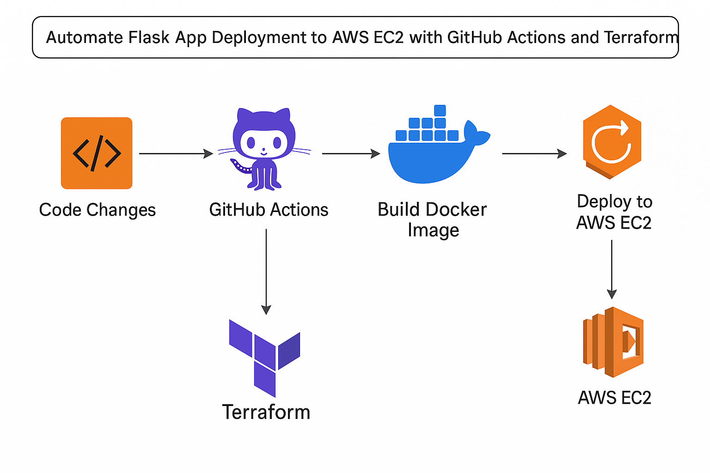

# AWS CI/CD Pipeline for Dockerized Flask Application using Terraform

&#x20;&#x20;

## Overview

This project demonstrates a complete CI/CD pipeline for deploying a Dockerized Flask application on AWS EC2, using Infrastructure as Code (IaC) with Terraform and CI/CD automation through GitHub Actions.



## Key Features

* 🚀 **Automated CI/CD pipeline** triggered by code changes
* 🔐 **Secure AWS infrastructure** using IAM, Security Groups, and EC2
* 🐳 **Containerized Flask app** using Docker with an optimized Dockerfile
* ☁️ **Terraform IaC** for repeatable, scalable infrastructure provisioning
* 🔄 **GitHub Actions workflows** for CI, CD, validation, and teardown
* 🧹 **Docker cleanup scripts** for managing local environment

## Directory Structure

```bash
aws-cicd-terraform/
├── infra/                  # Terraform infrastructure code
│   ├── variables.tf        # Input variable declarations
│   ├── terraform.tfvars    # Input values (excluded from Git)
│   ├── providers.tf        # AWS provider configuration
│   ├── data.tf             # Data sources (e.g., AMIs)
│   ├── ecr.tf              # ECR repository configuration
│   ├── ec2.tf              # EC2 instance configuration
│   ├── iam.tf              # IAM roles and policies
│   └── vpc.tf              # VPC, subnet, and networking setup
├── app/                    # Flask application source
│   ├── app.py              # Flask app code
│   └── requirements.txt    # Python dependencies
├── docker/                 # Docker config
│   └── Dockerfile          # Build instructions for Flask app
├── scripts/                # Helper scripts
│   └── docker-cleanup.sh   # Script to clean Docker environment
├── .github/workflows/      # GitHub Actions CI/CD workflows
│   ├── build-deploy.yaml   # Deploys on push to main
│   ├── on-pr.yaml          # Validates pull requests
│   ├── terraform.yaml      # Terraform plan/apply workflow
│   └── terra-destroy.yaml  # Destroy infrastructure
├── docs/                   # Documentation files
│   ├── utils.md            # Script and utility usage
│   └── instruction.txt     # Setup guide
├── .terraform-docs.yml     # Terraform Docs configuration
├── .gitignore              # Git ignored files
└── README.md               # This file
```

## Prerequisites

* AWS CLI configured
* Terraform v1.4+
* Docker installed
* GitHub account
* SSH key pair for EC2 access
* Familiarity with Flask, Docker, and Terraform

## Getting Started

### 1. Clone the Repository

```bash
git clone https://github.com/khoubate/aws-cicd-terraform.git
cd aws-cicd-terraform
```

### 2. Configure AWS Credentials

```bash
aws configure
```

Or export credentials as environment variables:

```bash
# Linux/macOS
export AWS_ACCESS_KEY_ID=your_access_key
export AWS_SECRET_ACCESS_KEY=your_secret_key

# Windows PowerShell
$env:AWS_ACCESS_KEY_ID="your_access_key"
$env:AWS_SECRET_ACCESS_KEY="your_secret_key"
```

### 3. Initialize Terraform

```bash
cd infra
terraform init
```

### 4. Deploy Infrastructure

```bash
terraform apply
```

### 5. Set GitHub Secrets

In your GitHub repository, add the following secrets:

* `AWS_ACCESS_KEY_ID`
* `AWS_SECRET_ACCESS_KEY`
* `AWS_ACCOUNT_ID`
* `SSH_PRIVATE_KEY`
* `ECR_REPO_NAME`

These are used by GitHub Actions for deployment.

## CI/CD Workflows

| File                 | Trigger                | Description                          |
| -------------------- | ---------------------- | ------------------------------------ |
| `build-deploy.yaml`  | Push to `main`         | Builds Docker image & deploys to EC2 |
| `terraform.yaml`     | Terraform file changes | Plans & applies Terraform changes    |
| `on-pr.yaml`         | Pull Requests          | Validates code and Terraform changes |
| `terra-destroy.yaml` | Manual Dispatch        | Destroys AWS infrastructure          |

## Usage

### Access the Flask App

After successful deployment, run:

```bash
curl http://<EC2_PUBLIC_IP>:80
```

Replace `<EC2_PUBLIC_IP>` with your actual EC2 instance IP.

### Cleanup Docker Environment

```bash
./scripts/docker-cleanup.sh
```

## Documentation

* [Setup Instructions](./docs/instruction.txt)
* [Utility Scripts Guide](./docs/utils.md)

## License

This project is licensed under the [MIT License](LICENSE).

## Contributing

1. Fork the repository
2. Create a feature branch: `git checkout -b feature/my-feature`
3. Commit your changes: `git commit -m 'Add my feature'`
4. Push to GitHub: `git push origin feature/my-feature`
5. Open a pull request

> ⚠️ **Important**: This project creates real AWS resources that may incur charges. Always run `terraform destroy` when you're done.

---

**Note:** Replace placeholders such as `<your-username>` and `<EC2_PUBLIC_IP>` with your actual values before use.
